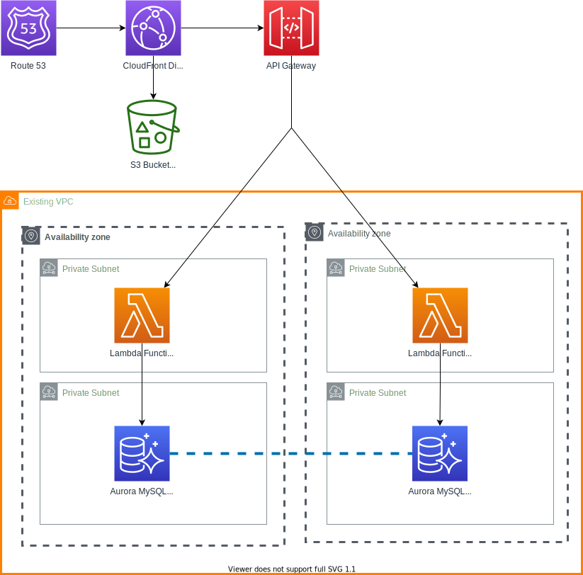

# terraform-aws-serverless-lamp

This Terraform module builds out a best practice reference architecture for running serverless PHP applications affectionally called modern LAMP:

- Lambda
- API Gateway
- MySQL
- PHP

# Solution

This is what this module aims to build:



# Usage 

```hcl
module "serverless-lamp" {
  source       = "./terraform-aws-serverless-lamp"
  app_name     = "your_app_name"
  app_env      = "dev"
  fqdns        = ["yoursite.com"]
  laravel_root = "${path.root}/../src"
}
```
